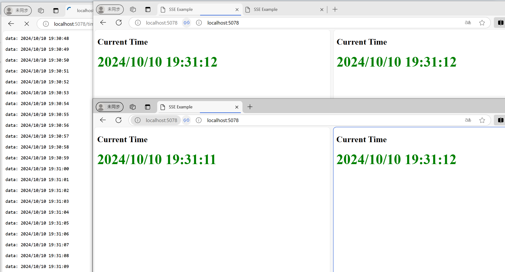

# 專案說明

這是用miniAPI 開發的簡易 web hook，它利用了SSE技術(Server Send Event)，能主動推送伺服器時間到每個端點。
若說 websocket 是雙向溝通的話，SSE 其實是單向溝通的，也就是說，一但連線建立之後，就只能接收 Server 端來的訊息。
如下圖，我們開了五個視窗，最左邊的視窗，利用瀏覽器原生聆聽 SSE功能(網址:[http://localhost:5078/time](http://localhost:5078/time))，持續收到並顯示收播內容。這個沒使用到任何網頁。
其他四個視窗，我們用了網頁([http://localhost:5078/index.html](http://localhost:5078/index.html))，搭配JavaScript功能，將收到的訊息動態更新在頁面上(每秒更新一次時間)。
有一個現象值得注意，無網頁的收播方式，會耗用許多CPU資源。使用 JavaScript 則不會。

